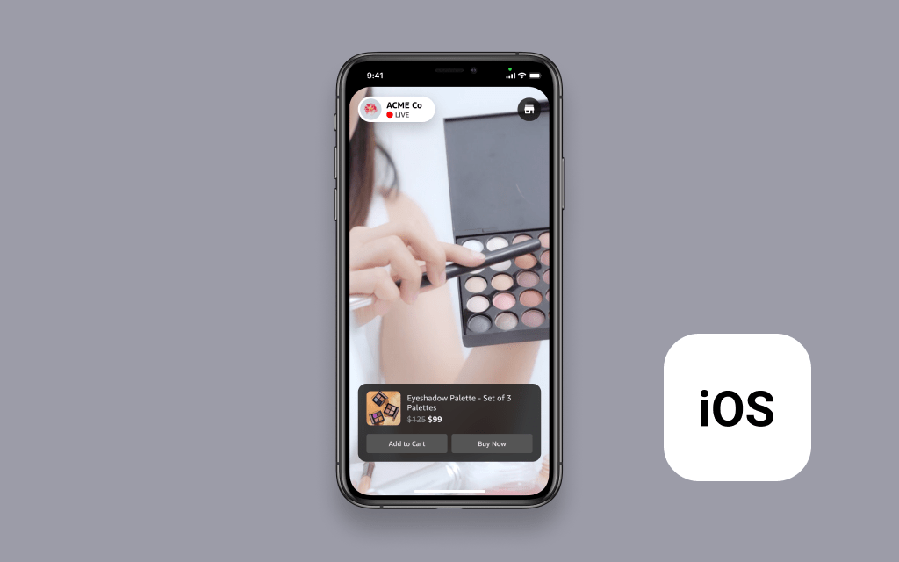

# Amazon IVS eCommerce iOS Demo

A demo iOS application intended as an educational tool for demonstrating how Amazon IVS can be used to build a compelling customer experience for eCommerce use-cases.



**This project is intended for education purposes only and not for production usage.**

This is an iOS application that uses [Amazon IVS TimedMetadata](https://docs.aws.amazon.com/ivs/latest/userguide/SEM.html) to show products. The demo is written in [Swift](https://developer.apple.com/swift/) and showcases how customers can load and play an Amazon IVS stream and display browsable product information using TimedMetadata.

This demo uses a 24/7 [looping stream](https://0e65d5729bda.us-west-2.playback.live-video.net/api/video/v1/us-west-2.484704431806.channel.qeejlweDQUeV.m3u8) which emits a TimedMetadata event every few seconds. These TimedMetadata events describe product information in json format, which is used by the app to show a carousel of products, and to highlight the product being shown on stream.

## Getting Started

To run this demo, you will need the following:

1. [Xcode](https://apps.apple.com/us/app/xcode/id497799835) 11 or greater. You can build this application for devices running iOS 10 or later.
2. [Cocoapods](https://cocoapods.org/), installed and up-to-date. You can quickly install cocoapods from Terminal with `sudo gem install cocoapods`.
3. [Bundler](https://bundler.io/), installed and up-to-date.
4. [Git](https://git-scm.com/) installed and up-to-date. You can quickly install git from Terminal with `xcode-select --install`.

To run the demo in the iOS Simulator:

1. Clone the project from this repository
2. Navigate to the project directory using _Terminal_
3. Run `bundle install`, then `bundle exec pod install`
4. Open `eCommerce.xcworkspace` in Xcode.
5. Click `Run` in the toolbar, or press `Cmd(⌘)-R`

You should see the iOS Simulator boot up and launch the demo app. This may take a few moments to complete. Once the app is launched in the simulator, tap on one of the images in the `LIVE` carousel top open a video. There are both portrait and landscape video examples in the app.

- To view a portrait stream: Tap the leftmost image in the carousel.
- To view a landscape stream: Tap the second-to-leftmost image in the carousel.

## Modifying this Example

### Prerequisites

**IMPORTANT NOTE:** Using your own stream will create and consume AWS resources, which will cost money.

1. Create and set up an Amazon IVS channel. [Getting started with Amazon IVS](https://docs.aws.amazon.com/ivs/latest/userguide/GSIVS.html).

### Using your own Live video

1. Open the [Amazon IVS Console](https://console.aws.amazon.com/ivs) and navigate to the channel you would like to use.
2. Copy the _Playback URL_ for the channel. The URL should end in `.m3u8`. (For example: `https://4da4a22026d3.us-west-2.playback.live-video.net/api/video/v1/us-west-2.298083573632.channel.WbhDQYgfYHoT.m3u8`).
3. In Xcode, open `eCommerce/ViewControllers/HomeViewController.swift`.
4. If you are streaming portrait video, replace the string on line `20` with the _Playback URL_ from step 2. For landscape video, replace the string on line `21`.
5. Save and build the application. Navigate to the leftmost image in the `LIVE` carousel to view landscape video, or the second-to-leftmost image to view portrait video.

### Using your own TimedMetadata events

Amazon IVS TimedMetadata provides a way to embed metadata in an Amazon IVS stream. It ensures that your users receive the metadata at the same time as the video stream, regardless of stream latency or geographic location. Learn how to embed TimedMetadata in stream: [Embedding Metadata within a Video Stream](https://docs.aws.amazon.com/ivs/latest/userguide/SEM.html).

This example expects an array of json that represents each product in the carousel. This approach is not recommended for production applications, given that it requires all product information to be contained in the stream's TimedMetadata. A more scalable approach using product indexes in TimedMetadata and [Amazon DynamoDB](https://aws.amazon.com/dynamodb/) is documented in the [Amazon IVS eCommerce Web Demo](https://github.com/aws-samples/amazon-ivs-ecommerce-web-demo).

```
"metadata" : {
  "products": [
	{
	  "id": 0,
	  "priceDiscount": "$<product-discount-price>",
	  "priceOriginal": "$<product-original-price>",
	  "imageUrl": "<product-image-url>",
	  "name": "<product-name>",
	  "webLink": "<product-details-url>",
	  "isFeatured": <BOOL | true if currently on stream, false if not>,
	  "lastPurchaser": {
		"username": "<purchaser-name>",
		"userprofile": "<purchaser-image-url>"
	  }
	},
	{
	  "id": 1,
	  "priceDiscount": "$<product-discount-price>",
	  "priceOriginal": "$<product-original-price>",
	  ...
	},
	...
  ]
}
```

## Additional Notes

For production applications, we recommend using TimedMetadata alongside services like [AWS Lambda](https://aws.amazon.com/lambda/), [Amazon API Gateway](https://aws.amazon.com/api-gateway/), and [Amazon DynamoDB](https://aws.amazon.com/dynamodb/). These services will let you store and retrieve product information in a more scalable way. See the [Amazon IVS eCommerce Web Demo](https://github.com/aws-samples/amazon-ivs-ecommerce-web-demo) for example code using these services.

## Documentation

- [Amazon IVS Amazon Interactive Video Service (Amazon IVS)](https://aws.amazon.com/ivs/) is a managed live streaming solution that is quick and easy to set up, and ideal for creating interactive video experiences. Simply send your live streams to Amazon IVS and the service does everything you need to make ultra-low latency live video available to any viewer around the world, letting you focus on building interactive experiences alongside the live video. [Learn more](https://aws.amazon.com/ivs/).
- [Amazon IVS docs](https://docs.aws.amazon.com/ivs/)
- [User Guide](https://docs.aws.amazon.com/ivs/latest/userguide/)
- [API Reference](https://docs.aws.amazon.com/ivs/latest/APIReference/)

## Known Issues

- The application was written for demonstration purposes and not for production use.
- Currently only tested in the us-west-2 (Oregon) region. Additional regions may be supported depending on service availability.

## License

This sample code is made available under a modified MIT license. See the LICENSE file.
